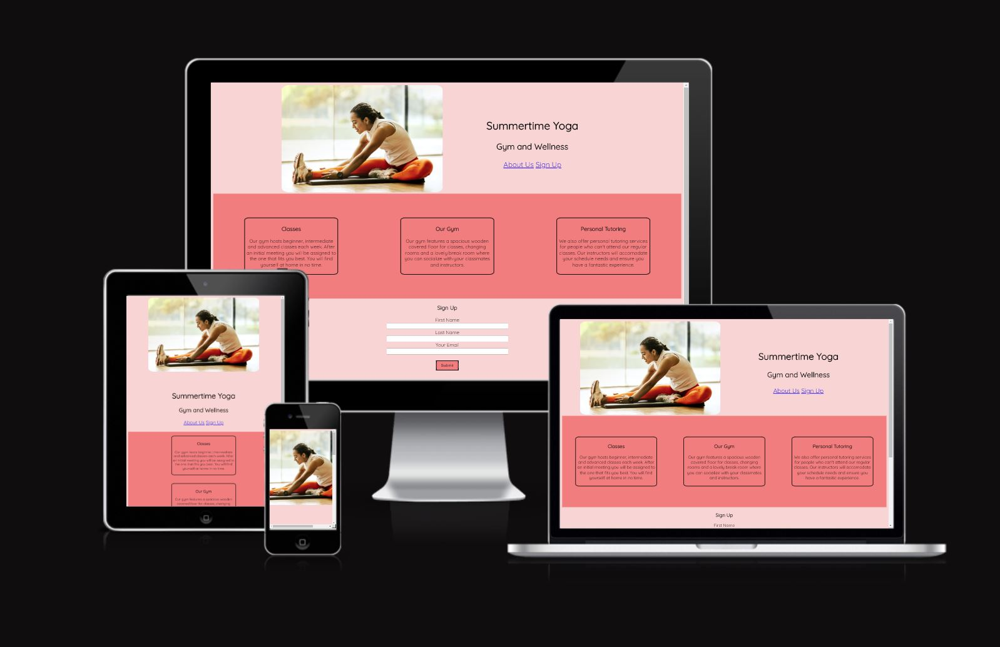
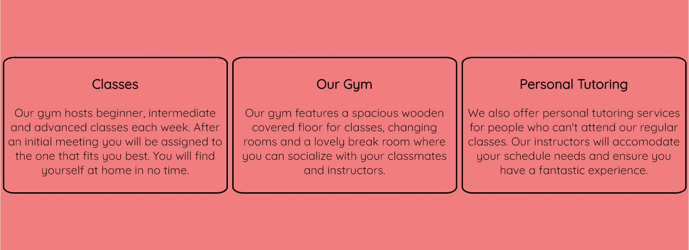
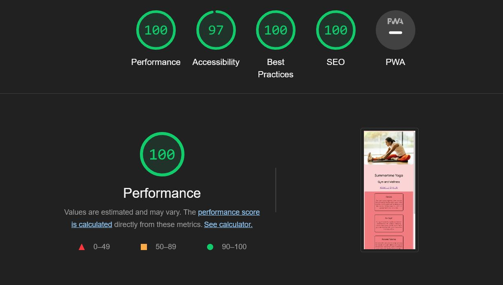

# Summertime Yoga

Summertime Yoga is a website for a Yoga gym based in London, England. The site is meant for people who want to pick up yoga at a professional gym and look for a welcoming, professional environment that offers group and individual classes or lessons. It offers a way for people to discover the gym's offer and get in contact with it.  

## Features 

- __Landing Page and Navigation__

  This section welcomes the user on the website and provides useful navigation links to quickly get to the other sections of the site directly from the top. It's expecially useful on mobile screens. 

- __Gym Features Section__

  This section covers the various features offered by the gym. It explains the different kinds of classes the gym offers and the kind of space the trainees will find themselves into. It's useful for the website users to quickly assess which kind of gym they may be signing up for and what kind of services they can expect. 

- __Signup Section__

  This section will give the users the ability to sign up for the gym and get in contact with the staff directly through email. 

- __Footer__ 

  The footer offers an alternative way to contact the Gym via phone, and it also allows the user to check the opening and closing times during the week. 

## Testing 

- I've tested the website to ensure that it would work in a responsive way on phones, tablets and desktops. The site automatically resizes depending on the screen size it's viewed on through the use of Flexbox containers and media queries that allow the content to display correctly at any screen size.

- I've discovered and fixed a bug that would incorrectly display text in a different color when media queries would activate. This was due to a change in text color being done on desktop CSS but not inside the media query. It resulted in the text being black on desktop and white on mobile. 

- The Signup Form has been tested and it's working correctly. It only accepts a valid email address in the relevant form field and correctly processes the data when the submit button is pressed. 

- The website has been tested for Accessibility through the use of Lighthouse available inside Chrome Developer Tools. 

- The website mobile view displays correctly in Lighthouse and in the browser but not on ami.responsivedesign.is despite the website being able to display correctly on very small screen sizes. 

### Validator Testing 

- HTML
  - No errors were returned when passing through the official [W3C validator](https://validator.w3.org/nu/?doc=https%3A%2F%2Fcode-institute-org.github.io%2Flove-running-2.0%2Findex.html)
- CSS
  - No errors were found when passing through the official [(Jigsaw) validator](https://jigsaw.w3.org/css-validator/validator?uri=https%3A%2F%2Fvalidator.w3.org%2Fnu%2F%3Fdoc%3Dhttps%253A%252F%252Fcode-institute-org.github.io%252Flove-running-2.0%252Findex.html&profile=css3svg&usermedium=all&warning=1&vextwarning=&lang=en#css)

## Deployment

The project has been deployed through GitHub pages. It is available at the following link - https://alex-rep.github.io/summertime-yoga/

## Credits 

The image for the main section of the website was found on [Pexels](https://www.pexels.com/).